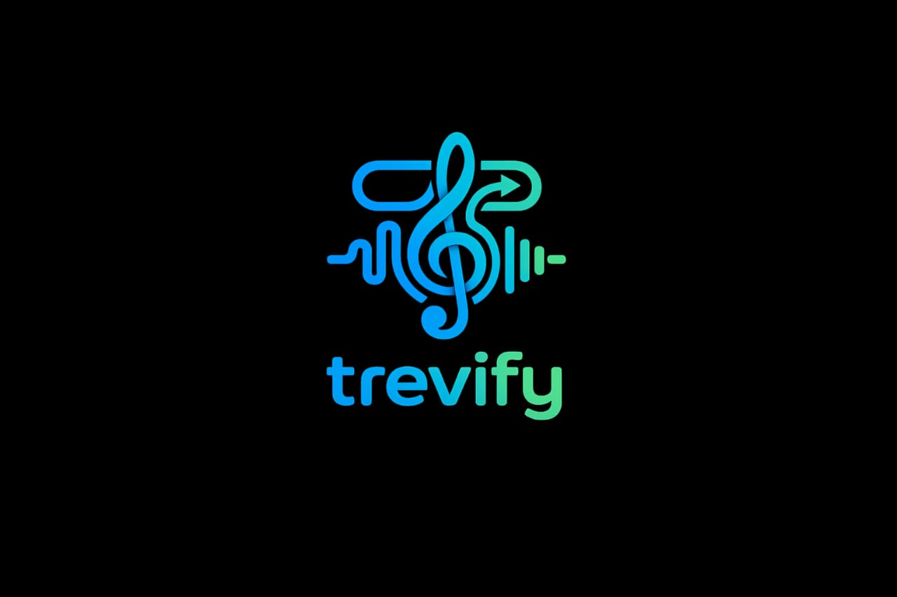

<p align="center">
  
</p>

<h1 align="center">🎵 Trevify Music</h1>

<p align="center">
  <b>A modern, adaptive music player for Android — stream online hits or play your local library, all in one beautiful app.</b>
</p>

<p align="center">
  
  
  
  
</p>

---

## ✨ Features

### 🎧 Dual-Mode Playback
- **Explore (Online)** — Search and stream millions of songs via the JioSaavn API. No downloads required.
- **Library (Local)** — Access and play all music stored on your device via MediaStore.

### 🎨 Adaptive & Dynamic UI
- **Blurred Album Art Background** — The main screen and player adapt their background to the currently playing song's album art using Glide blur transformations.
- **Palette-Based Theming** — Extracts vibrant colors from album art using Android's Palette API to dynamically tint UI elements (buttons, badges, icons).
- **Dark Mode Support** — Toggle between light and dark themes from the Profile settings.
- **Now-Playing Indicator** — The currently playing track is highlighted in blue across all song lists.

### 🎛️ Full Playback Controls
- Play, Pause, Next, Previous
- Shuffle and Repeat (single track)
- Waveform-style seek bar for precise scrubbing
- Persistent mini-player at the bottom of the main screen
- Media notification with system controls (lock screen, headset buttons)

### ❤️ Favorites & Stats
- Tap the heart icon on any song to add/remove from favorites
- Dedicated Favorites screen with all your liked songs
- Play history tracking (recent 10 songs)
- Per-song play count statistics
- Profile page showing total songs, favorites count, and listening history

### 🔍 Smart Search
- **Online search** with debounced input (500ms) to reduce API calls
- **Local library search** with instant filtering
- Randomized initial Explore queries ("bollywood hits", "lofi mashup", "top songs 2024", etc.) for fresh content on every app launch

### 🔊 Reliable Background Streaming
- Foreground service with media notification for uninterrupted playback
- Wake locks (`WAKE_MODE_NETWORK`) to prevent Android Doze from killing streams
- Automatic audio focus management
- Auto-pause when headphones are disconnected
- Automatic error recovery — skips to the next track if a stream fails

---

## 🏗️ Architecture

```
com.trevify.music/
├── MainActivity.java          # Main screen with Explore/Library tabs, search, mini-player
├── playerActivity.java        # Full-screen player with waveform seek bar, controls, blur background
├── splashActivity.java        # Animated splash/onboarding (shown only on first launch)
├── FavoritesActivity.java     # Favorites list with playback
├── ProfileActivity.java       # User profile, stats, theme toggle, listening history
│
├── MusicService.java          # Media3 MediaSessionService (foreground service for playback)
├── MusicPlayerManager.java    # Singleton playback controller (playlist, shuffle, repeat, seek)
│
├── SaavnApi.java              # JioSaavn API client (search, parse tracks)
├── SaavnTrack.java            # Data model for online tracks (id, name, artist, downloadUrl, etc.)
├── Song.java                  # Unified data model for both local and online songs (Parcelable)
│
├── SongAdapter.java           # RecyclerView adapter for local library songs
├── OnlineTrackAdapter.java    # RecyclerView adapter for online search results
│
├── FavoritesManager.java      # SharedPreferences-based favorites persistence
└── StatsManager.java          # Play count and recent history tracking
```

---

## 📦 Tech Stack & Dependencies

| Component | Library | Purpose |
|---|---|---|
| **Media Playback** | [Media3 ExoPlayer](https://developer.android.com/media/media3/exoplayer) `1.2.1` | Audio decoding, streaming, and media session |
| **Image Loading** | [Glide](https://github.com/bumptech/glide) `4.15.1` | Album art fetching, caching, and transformations |
| **Blur Effects** | [Glide Transformations](https://github.com/wasabeef/glide-transformations) `4.3.0` | Frosted glass blur backgrounds |
| **Color Extraction** | [Palette](https://developer.android.com/develop/ui/views/graphics/palette-colors) `1.0.0` | Extract dominant colors from album art |
| **Seek Bar** | [WaveformSeekBar](https://github.com/niccoloZelwororth/WaveformSeekBar) `1.1` | Waveform-style progress indicator |
| **Networking** | [OkHttp](https://square.github.io/okhttp/) `4.12.0` | HTTP client for JioSaavn API requests |
| **Online Music API** | [JioSaavn API](https://docs.saavnapi.js.org/) | Song search, metadata, and streaming URLs |
| **UI Framework** | Material Design 3 + ConstraintLayout | Modern Android UI components |
| **View Binding** | Android View Binding | Type-safe view references |

---

## 🚀 Getting Started

### Prerequisites

- **Android Studio** Ladybug or later
- **JDK 11** or higher
- **Android SDK** with API 36 installed
- A physical device or emulator running **Android 9 (API 28)** or higher

### Build & Run

1. **Clone the repository**
   ```bash
   git clone https://github.com/saahiyo/trevify.git
   cd trevify
   ```

2. **Open in Android Studio**
   - File → Open → Select the cloned project folder
   - Wait for Gradle sync to complete

3. **Run the app**
   - Connect your Android device (USB debugging enabled) or start an emulator
   - Click ▶️ **Run** or press `Shift + F10`
   - Grant the **Audio/Media** permission when prompted

### Permissions

The app requires the following permissions:

| Permission | Purpose |
|---|---|
| `READ_MEDIA_AUDIO` | Access local music files (Android 13+) |
| `READ_EXTERNAL_STORAGE` | Access local music files (Android 12 and below) |
| `INTERNET` | Stream music from JioSaavn API |
| `FOREGROUND_SERVICE` | Keep music playing in the background |
| `FOREGROUND_SERVICE_MEDIA_PLAYBACK` | Android 14+ foreground service type |
| `POST_NOTIFICATIONS` | Show media playback notification |
| `WAKE_LOCK` | Prevent CPU/Wi-Fi sleep during streaming |

---

## 📱 Screenshots

> *Coming soon — the app features a clean, modern UI with adaptive backgrounds, a glassmorphic player screen, and a polished mini-player.*

---

## 🗺️ Roadmap

- [ ] Persist online track favorites across sessions
- [ ] Playlist creation and management
- [ ] Lyrics integration
- [ ] Equalizer support
- [ ] Download songs for offline playback
- [ ] Artist / Album browsing pages
- [ ] Queue management UI
- [ ] Cross-fade between tracks

---

## 🤝 Contributing

Contributions are welcome! Feel free to open issues or submit pull requests.

1. Fork the repository
2. Create your feature branch (`git checkout -b feature/amazing-feature`)
3. Commit your changes (`git commit -m 'feat: add amazing feature'`)
4. Push to the branch (`git push origin feature/amazing-feature`)
5. Open a Pull Request

---

## 📄 License

This project is licensed under the MIT License — see the [LICENSE](LICENSE) file for details.

---

<p align="center">
  Made with ❤️ by <a href="https://github.com/saahiyo">Shakir</a>
</p>
